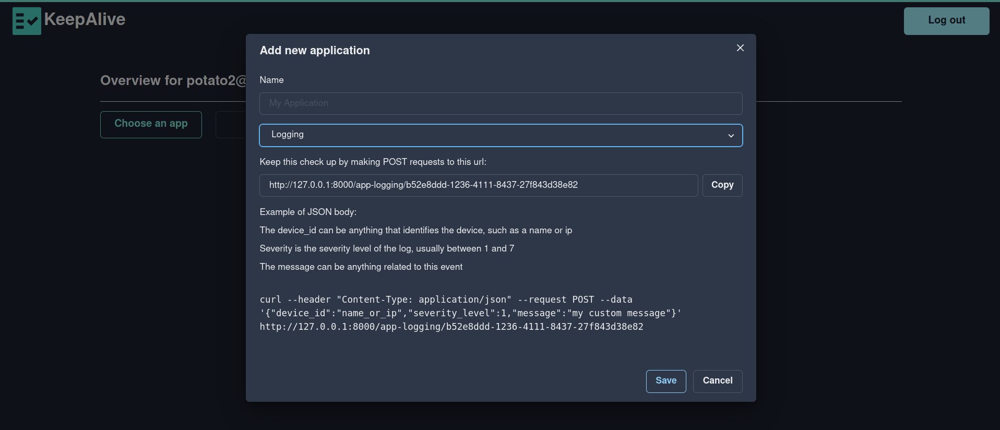
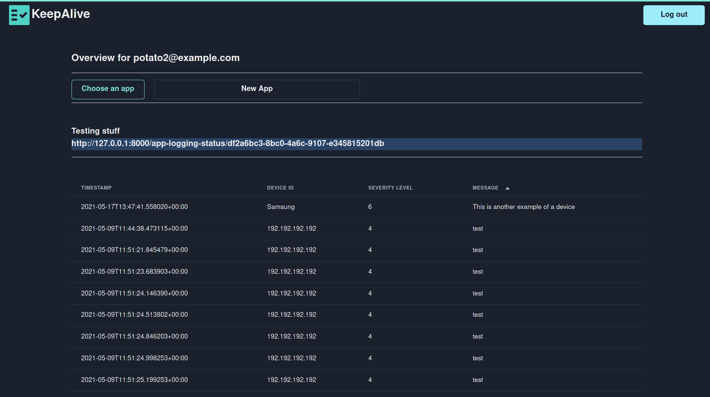

# KeepAlive

## Requirements

* "healthchecks" pentru cron-jobs, backups, expirare certificate, scanuri antivirus
* poti verifica daca o aplicatie ruleaza (process, container, resurse sistem)
* obtine simple log-uri cu orice vrei (optional cu machine learning)
* diagrame cute
* notificari pentru job-uri via email

## Specifications

Folosim python cu framework-ul [FastAPI](https://fastapi.tiangolo.com/) pentru backend si (probabil) ca database folosim sqlite3 (sau postgres), cu tortoise orm pentru python.

Pentru frontend vom folosi [NextJS](https://nextjs.org/) cu [Chakra UI](https://chakra-ui.com/) ca component framework si [Bulma CSS](https://bulma.io/) daca este nevoie.

In final, am vrea sa dockerizam aplicatia, si sa o punem in spatele unui 
reverse proxy ([Caddy](https://caddyserver.com/docs/quick-starts/reverse-proxy)). Pe parcurs ne-am dori sa folosim Github Actions pentru CI/CD.

## Workflow

User-ul se logheaza si poate creea **jobs** pentru care poate primii periodic
notificari (ex: daca mi-a reusit backup-ul la database, informeaza-ma)
si va avea si un dashboard cu statistics/logs daca are nevoie.

In functie de ce tip de notificari are nevoie, user-ul are posibilitatea sa interactioneaze cu aplicatia agent-less (de exemplu: curl https://my-site/my-job → response OK) sau cu agenti (de exemplu: monitorizarea de resource usage sau logging).

_temporary architecture_

# Design

# Adding a new app

# Checking the status of your devices

## health check

## logging
